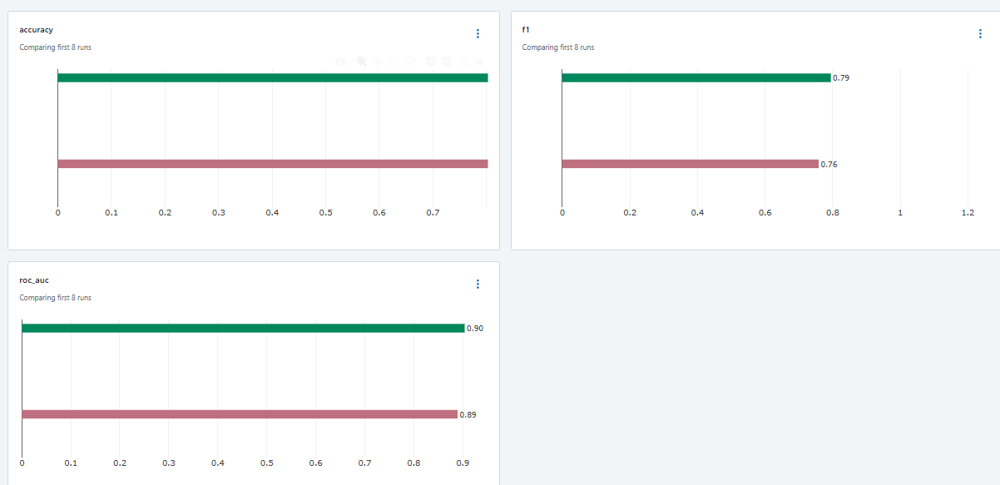
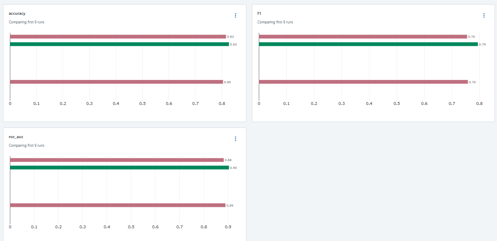
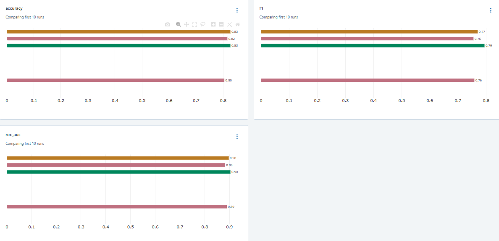

## Лабораторная работа 2

По причине слишком долгого обучения модели для сегментации глиом 
на основе датасета BRats2020 (6 часов) было принято решения для данной лабораторной работы взять более простой датасет и модель

Для данной лабораторной работы был взят фреймворк MLFlow и датасет titainc с решением задачи классификации
Метрики: Accuracy, F1, ROC-AUC

MLFlow-сервер был развёрнут через Docker и запуски экспериментов проводились локально

### Метрики baseline-модели:

### Гипотезы относительно модели:

- Добавление новых признаков повысит точность модели
- Оптимизация гиперпараметров RandomForest улучшит метрики
- Использование CatBoost вместо RandomForest даст прирост качества

Первая гипотеза строится на том, что датасет титаника можно дополнить, например добавить информацию об образнии к пассжиру и т.д
Вторая гипотеза предполагает, что найдя оптимальные значения гиперпараметров можно повысить качество модели
Третья гипотеза предполагает, что использование градиентного бустинга вместо случайного леса может повысить качество классификации

### Первая гипотеза:

Добавили флаг наоичия семьи и титула обращения

Все метрики незначительно возросли:

### Вторая гипотеза:

Нашли наилучшие параметры с помощью GridSearchCV

### Третья гипотеза:

Использовали CatBoost

### Вывод

Смена модели не дала особых результатов, в то время как объединение гипотез о добавлении признаков и поиске оптимальных параметров может дать криайне хорошее повышение качества, судя по тому, что первая гипотеза дала наибольший результат
MLFlow по итогу оказался удобным инструментом, хотя очень много времени ушло на мысли о том, 
каким образом его лучше всего разворачивать и каким образом лучше всего создавать эксперименты, 
однако разнообразие подходов к настройке environment и mlserver является огромным плюсом для open-source проекта

[ссылка на код](github.com/Peacetongue/mlops)