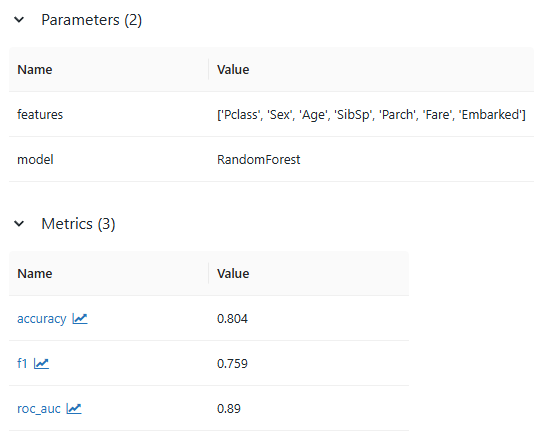

## Лабораторная работа 2

По причине слишком долгого обучения модели для сегментации глиом 
на основе датасета BRats2020 (6 часов) было принято решения для данной лабораторной работы взять более простой датасет и модель

Для данной лабораторной работы был взят фреймворк MLFlow и датасет titainc с решением задачи классификации
Метрики: Accuracy, F1, ROC-AUC

MLFlow-сервер был развёрнут через Docker и запуски экспериментов проводились локально

### Метрики baseline-модели:

### Гипотезы относительно модели:

- Добавление новых признаков повысит точность модели
- Оптимизация гиперпараметров RandomForest улучшит метрики
- Использование CatBoost вместо RandomForest даст прирост качества

Первая гипотеза строится на том, что датасет титаника можно дополнить, например добавить информацию об образнии к пассжиру и т.д
Вторая гипотеза предполагает, что найдя оптимальные значения гиперпараметров можно повысить качество модели
Третья гипотеза предполагает, что использование градиентного бустинга вместо случайного леса может повысить качество классификации

### Первая гипотеза:

Добавили флаг наоичия семьи и 

[ссылка на код](github.com/Peacetongue/mlops)