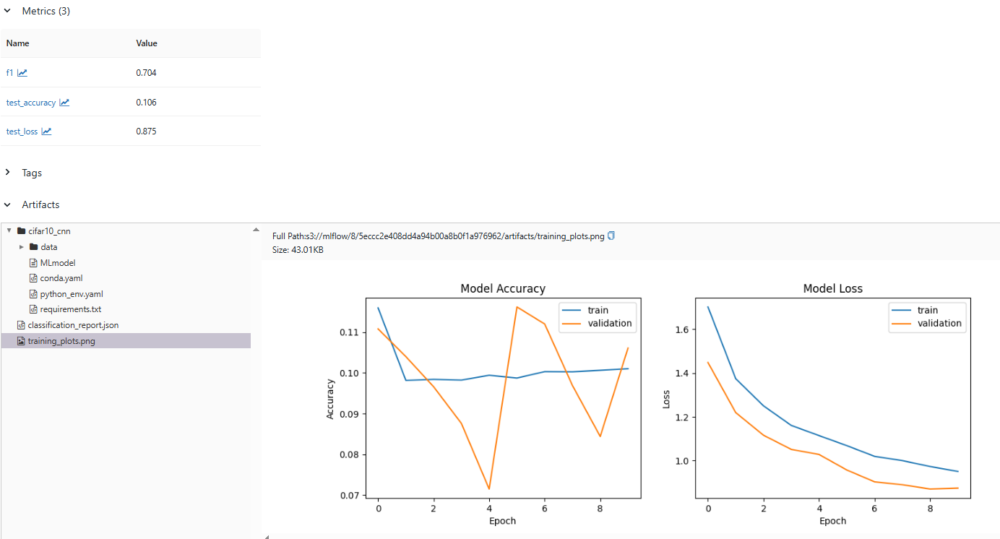

## Лабораторная работа 2

По причине слишком долгого обучения модели для сегментации глиом 
на основе датасета BRats2020 (6 часов) было принято решения для данной лабораторной работы взять более простой датасет и модель

Для данной лабораторной работы был взят фреймворк MLFlow и датасет CIFAR10 с решением задачи классификации
Метрики: Accuracy, F1, loss

MLFlow-сервер был развёрнут через Docker и запуски экспериментов проводились локально

### Метрики baseline-модели:

### Гипотезы относительно модели:

- Увеличение глубины сети улучшит качество классификации
- Увеличение разнообразия данных засчёт аугментации улучшит устойчивость и качество модели 
- Добавление слоёв dropout поможет с улучшением качества модели

Первая гипотеза строится на том, что увеличение глубины сети, улучшит её обучаемость
Вторая гипотеза предполагает, что добавление аугментированных данных разннобразит обучающую выборку и улучшит качество модели
Третья гипотеза предполагает, что добавление слоёв dropout снизит смещение при обучении и улучшит качество

### Первая гипотеза:

Добавили дополнительный слой и увеличили количество фильтров:

### Вторая гипотеза:

Добавили аугментацию данных

### Третья гипотеза:

Добавили два dropout слоя

### Вывод

Вторая и третья гипотезы не дали результатов, в то время как первая гипотеза немного улучшила качество модели
MLFlow по итогу оказался удобным инструментом, хотя очень много времени ушло на мысли о том, 
каким образом его лучше всего разворачивать и каким образом лучше всего создавать эксперименты, 
однако разнообразие подходов к настройке environment и mlserver является огромным плюсом для open-source проекта

[ссылка на код](github.com/Peacetongue/mlops)